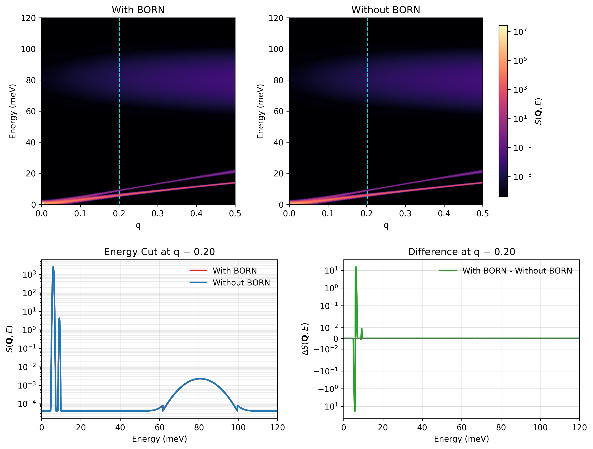

# BAs Example: Verifying `BORN` Handling in Dysurf

This example is designed to check the `BORN` / `nonanalytic` branch in Dysurf for polar corrections near the zone center. The material is cubic BAs, and the comparison is done by running the same SQE setup twice:

- `with BORN`: [BAs.txt]
- `without BORN`: [BAs_no_born.txt]

The goal is not just to produce `S(Q,E)`, but to confirm that the `BORN` block in the input file actually changes the phonon/SQE result in the expected code path.

## Background

In Dysurf, the `BORN` block is used together with:

- `nonanalytic = .TRUE.`
- dielectric tensor `epsilon`
- Born effective charges `born`

This activates the non-analytic correction in the phonon calculation. For comparison, the second input file disables this branch by using:

- `nonanalytic = .FALSE.`
- no `BORN` block

So this folder gives a direct A/B test for the code path related to long-range dipole corrections.

## Files

Core inputs and data:

- [BAs.txt]
- [BAs_no_born.txt]
- [FORCE_CONSTANTS]
- [POSCAR]
- [SQE_300K_born.dat] 
- [SQE_300K_no_born.dat] 
- [omega_born.dat] 
- [omega_no_born.dat] 

Plotting and summary:

- [plot_compare_q020_png.py](/home/davy/software/Dysurf/examples/BAs/plot_compare_q020_png.py)
- [BAs_compare_q0p20_summary.txt](/home/davy/software/Dysurf/examples/BAs/BAs_compare_q0p20_summary.txt)
- [BAs_compare_q0p20.png](/home/davy/software/Dysurf/examples/BAs/BAs_compare_q0p20.png)

## Main Input Parameters

The two inputs share the same SQE setup:

- `ntypes = 2`
- `natoms = 2`
- `nsize = 4 4 4`
- `elements = "B" "As"`
- `nat = 1 1`
- `temp = 300.d0`
- `lxray = .TRUE.`
- `qmesh = 20 20 20`
- `path(:,1) = 1 0 0`
- `q0 = 0 0 4`
- `ne = 2400`
- `deltaE = 0.05`
- `nqh = 200`
- `deltaH = 0.005`
- `deltaK = 0.01`
- `deltaL = 0.01`
- `lresfunc = .TRUE.`
- `functype = "CNCS12"`
- `xm = 2`

The only intended physics difference is:

- [BAs.txt](/home/davy/software/Dysurf/examples/BAs/BAs.txt): `nonanalytic = .TRUE.` and includes `BORN`
- [BAs_no_born.txt](/home/davy/software/Dysurf/examples/BAs/BAs_no_born.txt): `nonanalytic = .FALSE.` and omits `BORN`

In [BAs.txt](/home/davy/software/Dysurf/examples/BAs/BAs.txt), the `BORN` section contains:

- isotropic dielectric tensor with diagonal value `9.823`
- Born effective charges for B and As

## How To Run

Run the two SQE calculations:

```bash
cd /home/davy/software/Dysurf/examples/BAs
mpirun -np 1 ../../src/src_gfortran/dysurf BAs.txt
cp SQE_300K.dat SQE_300K_born.dat
cp omega.dat omega_born.dat

mpirun -np 1 ../../src/src_gfortran/dysurf BAs_no_born.txt
cp SQE_300K.dat SQE_300K_no_born.dat
cp omega.dat omega_no_born.dat
```

Generate the comparison figure with the existing conda environment:

```bash
cd /home/davy/software/Dysurf/examples/BAs
source /home/davy/miniconda3/etc/profile.d/conda.sh
conda activate neutronpy
python plot_compare_q020_png.py
```

## Current Comparison Result

The current figure compares:

- upper left: `with BORN` SQE
- upper right: `without BORN` SQE
- lower left: line cut at `q = 0.2` using log scale
- lower right: `with BORN - without BORN` using symlog scale

Current summary from [BAs_compare_q0p20_summary.txt]:

- `Q range: 0.0 to 0.5`
- `Energy range: 0.0 to 120.0 meV`
- `Requested q cut: 0.2000`
- `Actual q cut: 0.202170`
- `Line-cut y-scale: log`
- `Difference y-scale: symlog (linthresh=1.836120e-02)`
- `Max abs difference at q-cut: 1.836120e+01`

## Figure

As shown in upper panels of below figure, the overall difference between the calculations with and without the Born correction is not very large; however, its effect on the scattering intensity is still visible. For example, for the slice at q=0.2, a noticeable difference appears in the low-frequency phonon intensity(the lower-right panel). This is likely because the Born correction modifies the distribution of the optical branches to some extent, which in turn affects the distribution of S(Q, E).

