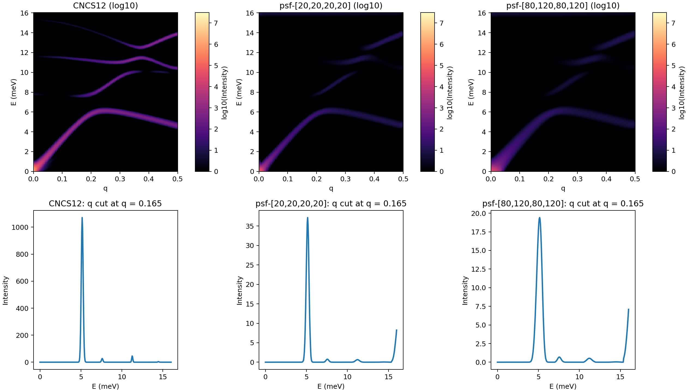

# 2+H00_CNCS12_psf2d_hcol_compare

This folder is the full Dysurf comparison example. It compares one legacy empirical resolution model against two formal TAS `psf2d` calculations:

- `CNCS12`
- `psf2d` with `hcol = [20,20,20,20]`
- `psf2d` with `hcol = [80,120,80,120]`

Its purpose is to show how the old `functype="CNCS12"` path differs from the newer TAS Cooper-Nathans + `psf2d` main mode, and how the TAS horizontal collimation changes the final convolved `S(Q,E)`.

## What This Folder Does

- runs one baseline legacy `CNCS12` SQE calculation
- runs two TAS `psf2d` SQE calculations with different horizontal collimations
- compares 2D SQE maps
- compares a representative mid-q energy cut
- writes a numerical comparison summary

## Main Input Files

- [PdSe2_CNCS12.txt]
- [PdSe2_psf2d_hcol_20.txt]
- [PdSe2_psf2d_hcol_80_120.txt]
- [run_example.sh]
- [compare_cncs12_psf_hcol.py]

## TAS Parameters

The TAS parameters in the two `psf2d` inputs are now commented inline. The important ones are:

- `tas_mode = 'CN'`: Cooper-Nathans TAS branch
- `tas_fix_mode = 'Ef'`: fixed final energy mode
- `tas_obs_mode = 'psf2d'`: fitted local 2D PSF observation operator
- `tas_use_cn = .TRUE.`: enable CN resolution path
- `tas_use_mosaic = .TRUE.`: include mosaic contribution
- `tas_e_fixed = 14.7d0`: final neutron energy
- `tas_coll_h_*`: four horizontal collimations in arcmin
- `tas_mosaic_*_h`: horizontal mosaics
- `tas_dm`, `tas_da`: PG(002) d spacing
- `lresfunc2d_psf = .TRUE.`: write fitted PSF side outputs
- `u`, `v`: sample orientation vectors used by the `psf2d` 4D-resolution to local-PSF parameter pipeline

The baseline [**PdSe2_CNCS12.txt**] explicitly disables TAS mode and keeps the old `functype="CNCS12"` route.

## Orientation

To keep the three example folders consistent, the two `psf2d` inputs in this folder use the same orientation convention as the two local-PSF examples:

- `u = [1, 0, 0]`
- `v = [0, 1, 0]`

In this full SQE workflow:

- `path` defines the scan path and SQE grid
- `u` and `v` are separate runtime inputs used only by the `psf2d` local 4D resolution and PSF parameter estimation path
- the baseline `CNCS12` empirical run does not need `u/v`
- `q0 = [2, 0, 0]`

So the comparison is still aligned with the same `a* / b*` scattering plane as the other two example folders, while keeping `CNCS12` and `psf2d` responsibilities separate.

## How To Run

```bash
cd Dysurf/examples/CN_TAS_resolution_test/2+H00_CNCS12_psf2d_hcol_compare
bash run_example.sh
```

## Figures

This figure compares the original CNCS12 𝑆(**𝑄**, 𝐸) with PSF-broadened results for two different collimation settings. The PSF treatment broadens the phonon features and reduces the peak intensity, especially for the looser collimation case. **Importantly, the relative intensity among different phonon branches remains broadly consistent**, showing that the PSF broadening mainly smooths the spectrum without altering the overall branch-to-branch intensity pattern.



## Numerical Summary

**CNCS12 vs PSF(hcol-only) comparison**

- Q range = 0 to 0.495
- E range = 0 to 16.00 meV
- qmid index = 33
- qmid value = 0.165000

[**CNCS12**]
- shape = (100, 321)
- peak = 1.142377867266e+06
- sum = 1.258356857132e+07
- rel_l2_vs_cncs12 = 0.000000000000e+00

[**psf-[20,20,20,20]**]
- shape = (100, 321)
- peak = 4.194332458010e+04
- sum = 6.367411220379e+05
- rel_l2_vs_cncs12 = 9.662289865888e-01

[**psf-[80,120,80,120]**]
- shape = (100, 321)
- peak = 2.697563392845e+04
- sum = 6.440742107214e+05
- rel_l2_vs_cncs12 = 9.772671895865e-01
