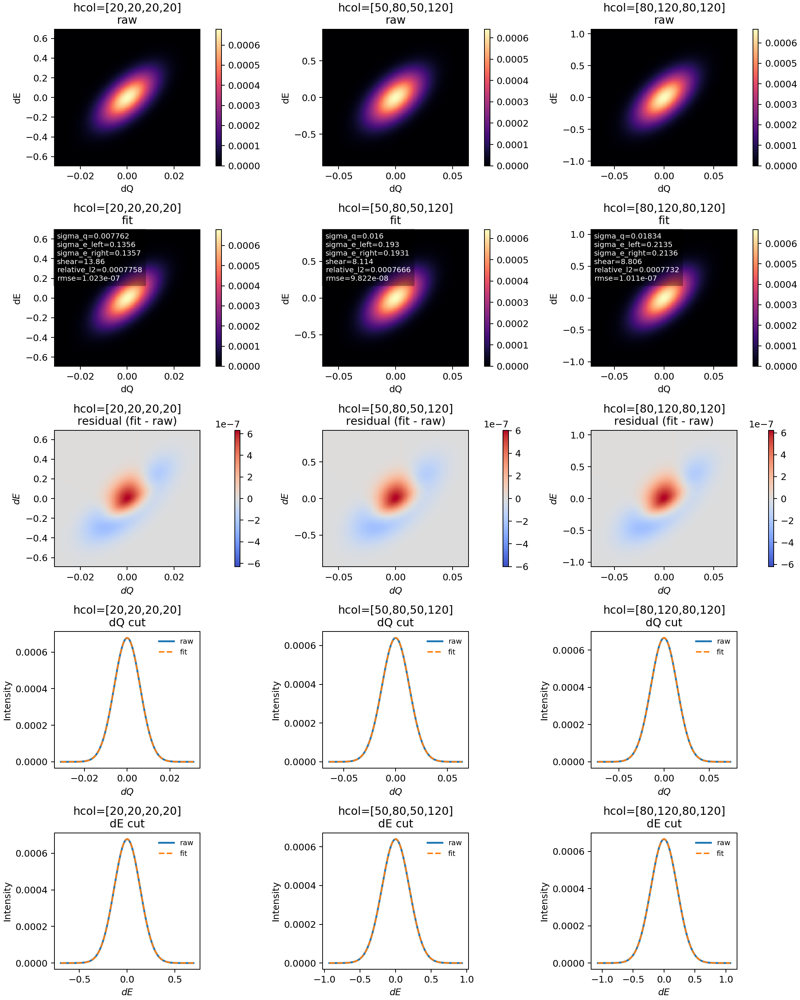
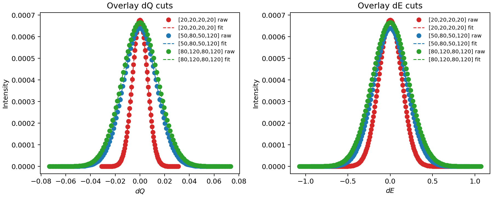

# Background
Testing the effect of horizontal collimation (hcol) on the TAS resolution

In TAS calculations, the instrumental resolution depends sensitively on the spectrometer setup, especially the horizontal collimations. In the present code, these are controlled by the four hcol parameters:

- pre_mono
- pre_samp
- post_samp
- post_ana

Changing these values modifies the local resolution in the (𝑑𝐐, 𝑑𝐸) plane. In general, looser collimation leads to a broader resolution function, while tighter collimation gives a narrower one. Since the TAS resolution is typically tilted and anisotropic, the broadening can appear differently in the momentum and energy directions.

The purpose of this test is to check how different hcol settings affect:

the overall 2D resolution shape from the CN calculation, the fitted local 2D PSF parameters, the 1D cuts along 𝑑𝐐 and 𝑑𝐸, the fitting quality of the PSF approximation

# 2+H00_psf2d_hcol_only_compare

This folder compares three local `psf2d` cases for the same PdSe2 nominal point, changing only the horizontal collimation (`hcol`) while keeping the other TAS parameters fixed.

Its purpose is to isolate how `tas_coll_h_pre_mono`, `tas_coll_h_pre_samp`, `tas_coll_h_post_samp`, and `tas_coll_h_post_ana` change the local 2D resolution function.

## What This Folder Does

- selects one representative `(𝐐, E)` point automatically
- evaluates the raw local 2D PSF for three `hcol` settings
- fits a sheared 2D PSF to each case
- compares raw maps, fitted maps, `d𝐐` cuts, and `dE` cuts
- overlays the three cuts for direct width comparison

The three presets are:

- `hcol_narrow = [20,20,20,20]`
- `hcol_base = [50,80,50,120]`
- `hcol_wide = [80,120,80,120]`

## Main Files

- [run_psf2d_hcol_only_compare.py]
- [run_example.sh]
- [instrument_hcol_narrow.txt]
- [instrument_hcol_base.txt]
- [instrument_hcol_wide.txt]
- [example_nominal_point.txt]
- [psf2d_hcol_only_summary.txt]

## TAS Parameters

The three instrument files are now commented so the meaning of each TAS parameter is explicit:

- `tas_mode = 'CN'`: Cooper-Nathans TAS resolution
- `tas_obs_mode = 'psf2d'`: fitted local 2D PSF output
- `tas_fix_mode = 'Ef'`: fixed final energy mode
- `tas_e_fixed = 14.7d0`: final neutron energy in meV
- `tas_coll_h_*`: the four horizontal collimation values in arcmin
- `tas_mosaic_*_h`: monochromator / analyzer / sample horizontal mosaic
- `tas_dm`, `tas_da`: monochromator / analyzer d spacing
- `u`, `v`: sample orientation vectors

`u` and `v` are now real runtime inputs. Each preset file carries its own orientation, and [run_psf2d_hcol_only_compare.py](./run_psf2d_hcol_only_compare.py) passes that orientation into [validate_psf2d_parametrization.f90](Dysurf/src/src_gfortran/validate_psf2d_parametrization.f90).
Their meaning is now exactly the same as the `u/v` parameters in the SQE `psf2d` example: they define the sample orientation used by the local TAS 4D-resolution to PSF parameter pipeline, not the scan path itself.

For the current presets, the orientation is kept the same across all three cases:

- `u = [1, 0, 0]`
- `v = [0, 1, 0]`

## How To Run

```bash
cd Dysurf/examples/CN_TAS_resolution_test/2+H00_psf2d_hcol_only_compare
bash run_example.sh
```

## Figures
**Figure 1** compares the overlaid d**Q** and 𝑑𝐸 cuts for three different horizontal-collimation settings:

- [20,20,20,20]
- [50,80,50,120]
- [80,120,80,120]

These curves show that increasing the collimation values broadens the resolution in both momentum and energy. The fitted curves closely follow the raw CN results in all cases.
Figure 1: 

**Figure 2** gives a more detailed comparison for each collimation setting. For each case, it shows:

- the original 2D resolution map (“raw”),
- the fitted local 2D PSF (“fit”),
- the residual map (fit - raw),
- the 1D cut along d**Q**,
- the 1D cut along 𝑑𝐸.

The residuals remain very small, and the fitted PSF reproduces both the 2D shape and the 1D cuts very well. This indicates that the local 2D PSF is a robust approximation to the CN resolution across different horizontal-collimation settings.


