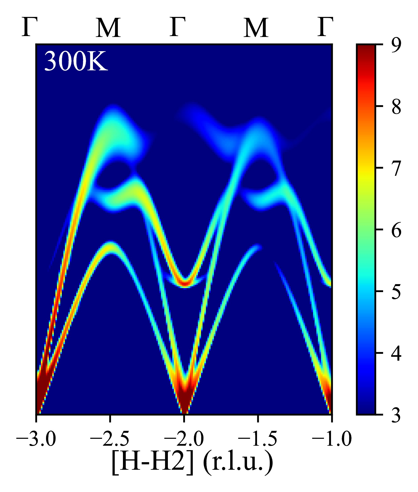
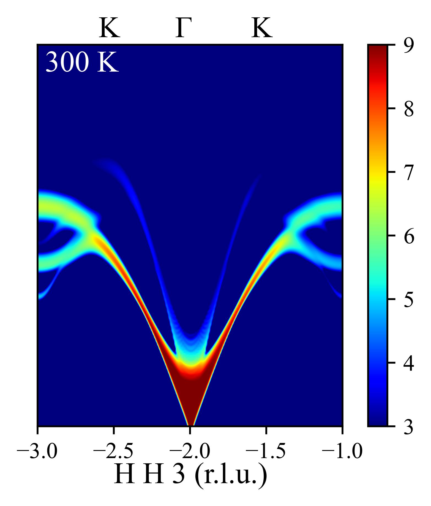

# SQE Calculation for GaN

This example demonstrates the existence of an arc branch (consisting of the TO mode at low-Q and LA mode at high-Q) and a TA mode exhibiting nesting behavior along the Γ–M(1 -1 0) and Γ–K(1 1 0) high-symmetry directions in GaN.

Below, we detail the parameter settings for the Γ–M direction and provide guidance for adapting the calculation to the Γ–K direction.

## Parameter Settings for Γ–M Direction

### 1. Basic Section

Based on the structural parameters in `./h-h2/POSCAR`, we configure the `&basic` section as follows:

- **ntypes = 2**: Two atom types (Ga and N).
- **natoms = 4**: Four atoms in the unit cell.
- **nsize = 4 4 3**: Supercell size of 4x4x3 for FORCE_CONSTANTS calculation.

### 2. Input SQE Section

Based on the POSCAR entry, we set:

- **elements = "Ga" "N"**: Specifies the elements.
- **nat = 2 2**: Two atoms of each type.

For the FORCE_CONSTANTS calculation, we use the primitive cell with lattice vectors:

```
3.1900000572   0.0000000000   0.0000000000
-1.5950000286   2.7626210876   0.0000000000
0.0000000000   0.0000000000   5.1900000572
```

To perform the calculation in an orthogonal lattice, we define `clatvec` as:

```
clatvec(:,1) = 3.1900000572   0.0000000000   0.0000000000
clatvec(:,2) = 0.0000000000   5.5252421752   0.0000000000
clatvec(:,3) = 0.0000000000   0.0000000000   5.1900000572
```

The calculation temperature is set to 300 K:

- **temp = 300.d0**

For neutron scattering calculations:

- **lneutron = .TRUE.**: Enable neutron scattering.
- **lxray = .FALSE.**: Disable X-ray scattering.

To ensure converged root-mean-square displacement (RMSD):

- **qmesh = 20 20 20**: Q-point mesh for integration.
- **write_rmsd = .TRUE.**: Write RMSD in the first calculation (comment out `read_rmsd = .TRUE.` for the first run).

For the energy range of 50 meV with a resolution of 0.1 meV:

- **ne = 500**: Number of energy points.
- **deltaE = 0.1**: Energy step size.

For the conventional cell of GaN, the Γ–M direction corresponds to \[1 -1 0\]. Note that \[1 -1 0\] is consistent between `LATTICE_PARAMETERS` and `clatvec`. Thus:

- **path(:,1) = 1 -1 0**: Specifies the Γ–M direction.
- **q0 = -3 3 2**: Starting point for the Q-vector.

Propagation along the H direction:

- **nqh = 400**: Number of Q-points along H.
- **deltaH = 0.005**: Step size along H.\
  Total propagation distance: `nqh * deltaH = 400 * 0.005 = 2`.

Integration in the K and L directions:

- **nqk = 10**, **nql = 10**: Number of Q-points in K and L directions.
- **deltaK = 0.01**, **deltaL = 0.01**: Step sizes in K and L directions.\
  Total integration thickness:
  - K direction: `nqk * deltaK = 10 * 0.01 = 0.1`
  - L direction: `nql * deltaL = 10 * 0.01 = 0.1`

No LO-TO splitting is considered:

- **nonanalytic = .FALSE.**

Instrument resolution for CNCS12:

- **lresfunc = .TRUE.**: Enable resolution function.
- **functype = "CNCS12"**: Specify CNCS12 instrument.
- **xm = 2**: Instrument parameter.

### 3. Lattice Parameters

Based on the POSCAR, the lattice parameters are:

```
LATTICE_PARAMETERS
1.d0
3.1900000572   0.0000000000   0.0000000000
-1.5950000286   2.7626210876   0.0000000000
0.0000000000   0.0000000000   5.1900000572
```

### 4. Atomic Positions

The atomic positions are:

```
ATOMIC_POSITIONS
Direct
0.333333357   0.666666714   0.000000000
0.666666620   0.333333314   0.500000000
0.333333357   0.666666714   0.376500004
0.666666620   0.333333314   0.876500004
```

### Complete Input File for Γ–M

Below is the complete input file for the SQE calculation along Γ–M:

```
! Example of SQE input file for GaN

&basic
ntypes = 2 
natoms = 4
nsize = 4 4 3
/

&inputsqe
elements = "Ga" "N"
nat = 2 2
clatvec(:,1) = 3.1900000572   0.0000000000   0.0000000000
clatvec(:,2) = 0.0000000000   5.5252421752   0.0000000000
clatvec(:,3) = 0.0000000000   0.0000000000   5.1900000572 
temp = 300.d0
lneutron = .TRUE.
lxray = .FALSE.
qmesh = 20 20 20
write_rmsd = .TRUE.
!read_rmsd = .TRUE.
path(:,1) = 1 -1 0
ne = 500
deltaE = 0.1
nqh = 400
nqk = 10
nql = 10
deltaH = 0.005
deltaK = 0.01
deltaL = 0.01
q0 = -3 3 2
nonanalytic = .FALSE.
lresfunc = .TRUE.
functype = "CNCS12"
xm = 2
/

LATTICE_PARAMETERS
1.d0
3.1900000572   0.0000000000   0.0000000000
-1.5950000286   2.7626210876   0.0000000000
0.0000000000   0.0000000000   5.1900000572

ATOMIC_POSITIONS
Direct
0.333333357   0.666666714   0.000000000
0.666666620   0.333333314   0.500000000
0.333333357   0.666666714   0.376500004
0.666666620   0.333333314   0.876500004
```

### Execution and Visualization for Γ–M

1. Navigate to the directory `./h-h2/`.
2. Run the command `/your_path_to_dysurf/dysurf GaN.txt` to compute the SQE data.
3. Execute the Python script `plotSQE.py` to generate the result:

   

## Parameter Settings for Γ–K Direction

To calculate the SQE along the Γ–K direction, modify the following parameters:

- **path(:,1) = 1 3 0**: Specifies the Γ–K direction.
- **q0 = -0.5 -1.5 3**: Starting point for the Q-vector.

Note: For GaN (space group 186), the Γ–K path corresponds to \[1 1 0\] in the primitive cell’s `LATTICE_PARAMETERS`, as verified using Cryst Bilbao. To convert to the `clatvec` coordinate system, use the `pri2con.py` tool or refer to our website http://36.138.185.163:5000/analysis. This conversion yields \[1 3 0\] in the `clatvec` system, ensuring the calculation’s correctness.

The input file for `pri2con.py` (`uc_vector.in`) is:

```
con 
3.1900000572   0.0000000000   0.0000000000
0.0000000000   5.5252421752   0.0000000000
0.0000000000   0.0000000000   5.1900000572 
pri 
3.1900000572   0.0000000000   0.0000000000
-1.5950000286   2.7626210876   0.0000000000
0.0000000000   0.0000000000   5.1900000572
p2c
2
1 1 0
-0.5 -0.5 3
```

### Execution and Visualization for Γ–K

After updating the input file with `path(:,1) = 1 3 0` and `q0 = -0.5 -1.5 3`, follow the same execution steps as above. The result is:

