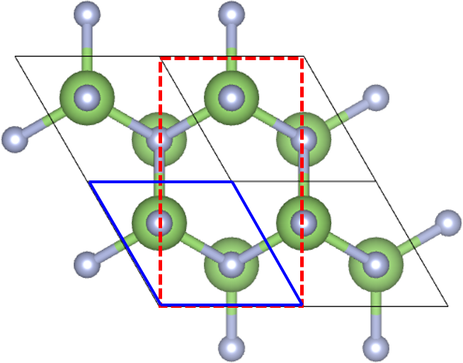
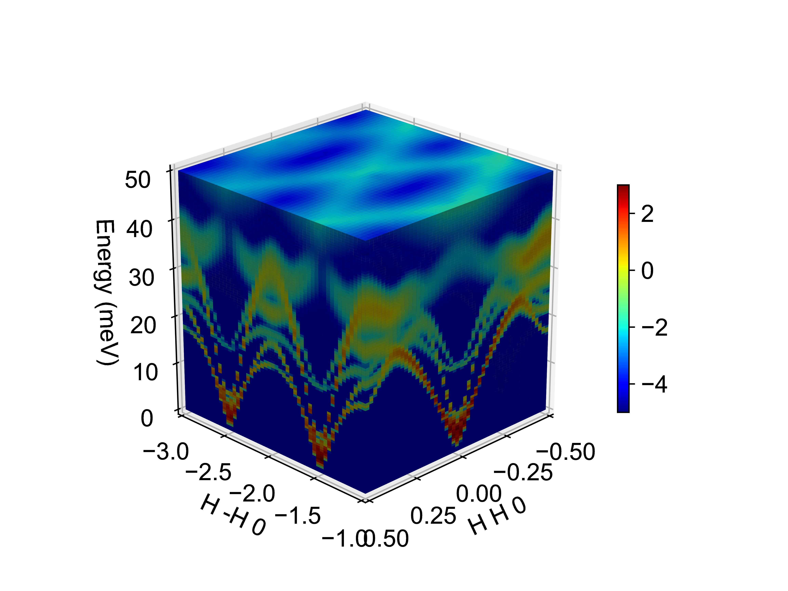
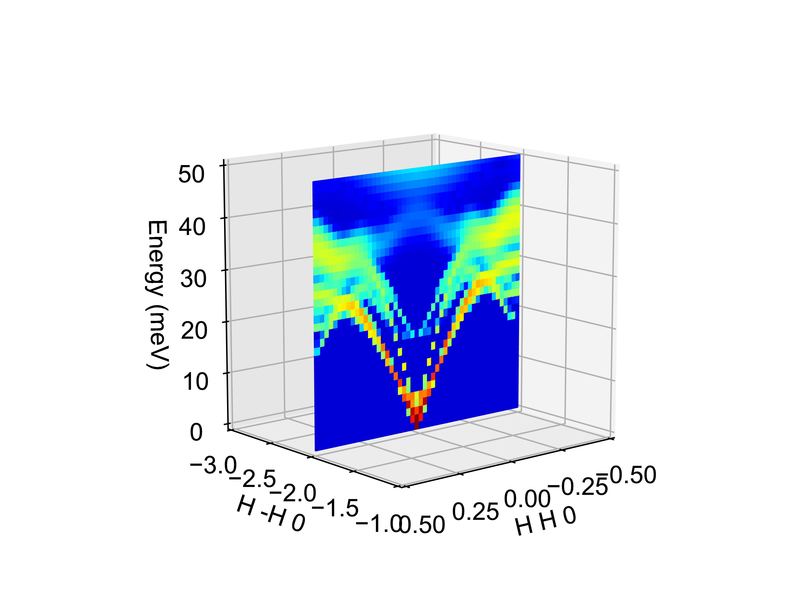

# Tutorial: 4D SQE Calculation for GaN

This tutorial explains how to set up a 4D dynamical structure factor (SQE) calculation for GaN to comprehensively map the phonon branch distribution across multiple Brillouin zones and their intensities. This approach facilitates comparison with experimental data by revealing phonon nesting effects in GaN with a wurtzite structure (space group 186). The provided input file is tailored for a 4D SQE calculation, capturing the full Q-space (H, K, L) and energy (E) dependence.

## Overview

To fully characterize phonon dispersion and intensities across multiple Brillouin zones, a 4D SQE calculation is performed. This involves sampling a three-dimensional Q-grid (H, K, L) and energy (E) to capture phonon nesting effects, which are critical for understanding lattice dynamics in GaN.

## Parameter Settings

### 1. Basic Section

The `&basic` section defines the system’s fundamental properties based on the POSCAR file:

- **ntypes = 2**: Specifies two atom types, Ga (Gallium) and N (Nitrogen).
- **natoms = 4**: Indicates four atoms in the unit cell, consistent with the wurtzite structure.
- **nsize = 4 4 3**: Defines a 4x4x3 supercell for the FORCE_CONSTANTS calculation to ensure accurate phonon sampling.

### 2. Input SQE Section

The `&inputsqe` section configures the parameters for the 4D SQE calculation:

- **elements = "Ga" "N"**: Specifies the elements in the unit cell.
- **nat = 2 2**: Indicates two atoms of each type (Ga and N).

To perform the calculation in an orthogonal lattice, the conventional lattice vectors (`clatvec`) are defined as:

```
clatvec(:,1) = 3.1900000572   0.0000000000   0.0000000000
clatvec(:,2) = 0.0000000000   5.5252421752   0.0000000000
clatvec(:,3) = 0.0000000000   0.0000000000   5.1900000572
```

These are derived from the primitive cell lattice vectors in the POSCAR:

```
3.1900000572   0.0000000000   0.0000000000
-1.5950000286   2.7626210876   0.0000000000
0.0000000000   0.0000000000   5.1900000572
```
This convertion refers to the below picture, which transfers from blue lattice vectors to red vectors.


- **temp = 300.d0**: Sets the temperature to 300 K, reflecting typical experimental conditions.
- **lneutron = .TRUE.**: Enables neutron scattering calculations.
- **lxray = .FALSE.**: Disables X-ray scattering calculations.
- **qmesh = 20 20 20**: Specifies a 20x20x20 Q-point mesh to ensure converged root-mean-square displacement (RMSD).
- **write_rmsd = .TRUE.**: Writes RMSD data in the first calculation. For subsequent runs, comment this out and use `read_rmsd = .TRUE.` to read the previously computed RMSD.

The high-symmetry paths for the 4D SQE calculation are defined to span multiple Brillouin zones:

- **path(:,1) = 1 3 0**: Specifies the primary direction, corresponding to the Γ–K(1 1 0) direction in the conventional cell.
- **path(:,2) = -1 1 0**: Defines the second direction for comprehensive Q-space sampling.
- **path(:,3) = 0 0 1**: Defines the third direction, typically along the c-axis in wurtzite GaN.

The path convertion refers to "../3D_SQE/GaN_3D_SQE_Calculation.markdown".

Energy settings:

- **ne = 100**: Sets 100 energy points.
- **deltaE = 0.5**: Specifies an energy step size of 0.5 meV, covering a 50 meV range (100 * 0.5).

Q-point sampling for the 4D grid:

- **nqh = 50**: Number of Q-points along the H direction.
- **nqk = 50**: Number of Q-points along the K direction.
- **nql = 20**: Number of Q-points along the L direction.
- **deltaH = 0.02**: Step size along H, giving a total range of `nqh * deltaH = 50 * 0.02 = 1.0`.
- **deltaK = 0.04**: Step size along K, giving a total range of `nqk * deltaK = 50 * 0.04 = 2.0`.
- **deltaL = 0.025**: Step size along L, giving a total range of `nql * deltaL = 20 * 0.025 = 0.5`.

Starting point for the Q-vector:

- **q0 = -1.5 -0.5 2**: Sets the origin of the reciprocal lattice path, chosen to explore multiple Brillouin zones.

No LO-TO splitting is considered:

- **nonanalytic = .FALSE.**

Instrument resolution settings for CNCS12:

- **lresfunc = .TRUE.**: Enables the instrument resolution function.
- **functype = "CNCS12"**: Specifies the CNCS12 instrument.
- **xm = 2**: Sets the instrument parameter.

4D calculation and phase factor:

- **l4D = .TRUE.**: Enables the 4D SQE calculation to capture the full (H, K, L, E) dependence.
- **lphase = .TRUE.**: Includes phase factors to account for interference effects in neutron scattering.

### 3. Lattice Parameters

The lattice parameters define the primitive cell, based on the POSCAR:

```
LATTICE_PARAMETERS
1.d0
3.1900000572   0.0000000000   0.0000000000
-1.5950000286   2.7626210876   0.0000000000
0.0000000000   0.0000000000   5.1900000572
```

### 4. Atomic Positions

The atomic positions in direct coordinates, as specified in the POSCAR, are:

```
ATOMIC_POSITIONS
Direct
0.333333357   0.666666714   0.000000000
0.666666620   0.333333314   0.500000000
0.333333357   0.666666714   0.376500004
0.666666620   0.333333314   0.876500004
```

### Complete Input File

Below is the complete input file for the 4D SQE calculation:

```
! Example of SQE input file for GaN

&basic
ntypes = 2 
natoms = 4
nsize = 4 4 3
/

&inputsqe
elements = "Ga" "N"
nat = 2 2
clatvec(:,1) = 3.1900000572   0.0000000000   0.0000000000
clatvec(:,2) = 0.0000000000   5.5252421752   0.0000000000
clatvec(:,3) = 0.0000000000   0.0000000000   5.1900000572 
temp = 300.d0
lneutron = .TRUE.
lxray = .FALSE.
qmesh = 20 20 20
write_rmsd = .TRUE.
!read_rmsd = .TRUE.
path(:,1) = 1 3 0
path(:,2) = -1 1 0
path(:,3) = 0 0 1
ne = 100
deltaE = 0.5
nqh = 50
nqk = 50
nql = 20
deltaH = 0.02
deltaK = 0.04
deltaL = 0.025
q0 = -1.5 -0.5 2
nonanalytic = .FALSE.
lresfunc = .TRUE.
functype = "CNCS12"
xm = 2
l4D = .TRUE.
lphase = .TRUE.
/

LATTICE_PARAMETERS
1.d0
3.1900000572   0.0000000000   0.0000000000
-1.5950000286   2.7626210876   0.0000000000
0.0000000000   0.0000000000   5.1900000572

ATOMIC_POSITIONS
Direct
0.333333357   0.666666714   0.000000000
0.666666620   0.333333314   0.500000000
0.333333357   0.666666714   0.376500004
0.666666620   0.333333314   0.876500004
```

### Execution

1. Place the input file (e.g., `GaN.txt`) in the working directory.
2. Run the command:
   ```bash
   /your_path_to_dysurf/dysurf GaN.txt
   ```
   This computes the 4D SQE data, capturing phonon dispersion and intensities across the specified Q-space and energy range.

### Visualization

To visualize the 4D SQE results, use a Python script (`./4D/plot_4D.py`) tailored for 4D data. This typically involves generating 2D slices or 3D projections of the (H, K, L, E) data to highlight phonon nesting effects. Here, we integrated the data along L direction and then we convert each q-point as a voxel in `./4D\/plot_4D.py`. 
After execute the`./4D/plot_4D.py`, we then get the results as shown below:


### Notes

- The 4D SQE calculation (`l4D = .TRUE.`) significantly increases computational cost due to the dense Q-grid (50x50x20 points in H, K, L). Ensure sufficient computational resources.
- The chosen `path` parameters (`1 3 0`, `-1 1 0`, `0 0 1`) and `q0 = -1.5 -0.5 2` are designed to span multiple Brillouin zones, enabling a comprehensive study of phonon nesting. Note the convertion between "
LATTICE_PARAMETERS" and "clatvec" coordinates in parameter setting.
- If comparing with experimental data, verify the Q-paths and instrument resolution (`CNCS12`) align with the experimental setup.
- For further analysis, consider tools like `pri2con.py` to convert between primitive and conventional cell coordinates, ensuring accurate Q-path definitions (e.g., as done for Γ–K(1 1 0) in previous examples at ).

This setup provides a robust framework for calculating and analyzing the 4D SQE of GaN, revealing phonon nesting effects critical for experimental validation.

### Slice from the 4D data
We also provide the python script(`./4D/plot_4D_slice1.py` and `./4D.plot_4D_slice2.py`) to slice from the 4D data.
`./4D/plot_4D_slice1.py` slices along [H H 0], thus we setting parameters as below in `./4D/plot_4D_slice1.py`:

```
# Extract slice at qh=25 (corresponding to qh=-2 plane)
sqebin_slice = sqebin[:, :, 25, :]
print("sqebin_slice shape:", sqebin_slice.shape)  # Expected shape: (101, 20, 50)

# Sum along axis=1 (ql, indices 0:4)
sqebin_slice_sum = np.sum(sqebin_slice[:, 0:4, :], axis=1)
print("sqebin_slice_sum shape:", sqebin_slice_sum.shape)  # Expected shape: (101, 50)

# Define coordinate arrays
x = np.linspace(-0.5, 0.5, 50)  # qk
y = np.ones((50)) * -2  # Fixed at qh=-2
z = np.linspace(0, 50, 101)  # energy

# Create meshgrid for surface plot, matching voxel_data shape
Z, X = np.meshgrid(z, x, indexing='ij')  # Shape: (101, 50)
Y = np.ones_like(Z) * -2  # Shape: (101, 50), y fixed at -2
```
After execute `./4D/plot_4D_slice1.py`, we get result as below:


If we want change another slicing path result, we just need change the slicing path as below(refers to `./4D/plot_4D_slice2.py`):
```
# Define coordinates
# Define start and end points
start_point = np.array([0.5, -2.5])
end_point = np.array([-0.5, -1.5])

# Generate 50 equally spaced points
points = np.linspace(start_point, end_point, 50)  # ([X,Y])
x = points[:,0]
y = points[:,1]
z = np.linspace(0, 50, 101)  # energy

# Create meshgrid for surface plot, matching voxel_data shape
Z, X = np.meshgrid(z, x, indexing='ij')  # Shape: (101, 50)
Y = np.ones_like(Z) * y  # Shape: (101, 50), y fixed for each point
```
After execute `./4D/plot_4D_slice2.py`, we get result as below:
![The SQE of a slice at a 45° angle to the [H H 0] direction](./4D/slice2.jpg)