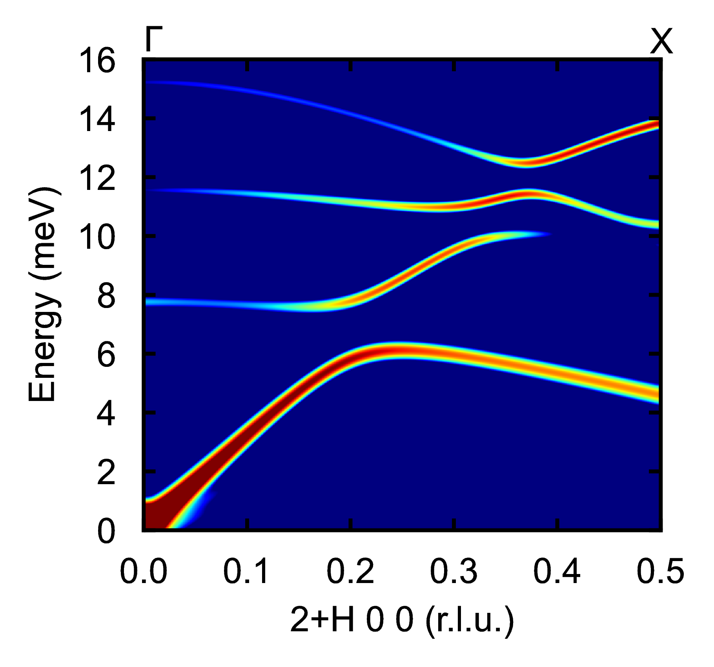
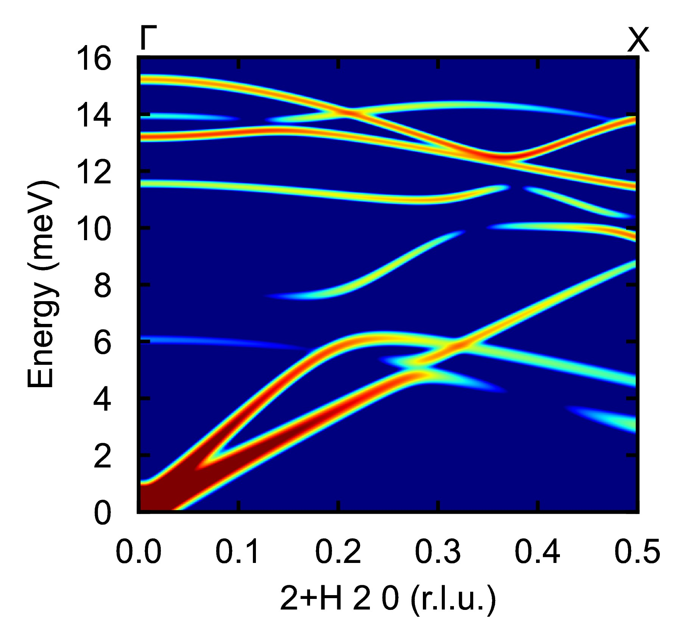

# Tutorial: SQE Calculation for PdSe2

This tutorial demonstrates the setup for calculating the dynamical structure factor (SQE) for PdSe2, a more complex system with 12 atoms per unit cell. In this example, we focus on how to appropriately select the Q-vector starting point (`q0`) and path directions (`path`) to explore phonon modes in such systems. PdSe2 has an orthorhombic structure, and the calculation is configured for X-ray scattering rather than neutron scattering, highlighting adaptations for different scattering types.

## Overview

For complex materials like PdSe2, with multiple atoms and potentially intricate phonon dispersions, careful selection of `q0` and `path` is crucial. Here, `q0 = 2.d0 0.d0 0.d0` is chosen to start at a specific Brillouin zone, and `path(:,1) = 1.d0 0.d0 0.d0` defines the direction along [H 0 0], allowing sampling of phonon branches along high-symmetry lines. This setup enables detailed analysis of SQE, useful for comparing with experimental data.

## Parameter Settings

### 1. Basic Section

The `&basic` section defines the system's core properties based on the structural parameters:

- **ntypes = 2**: Specifies two atom types, Pd (Palladium) and Se (Selenium).
- **natoms = 12**: Indicates 12 atoms in the unit cell, reflecting the complexity of PdSe2's structure.
- **nsize = 2 2 2**: Defines a 2x2x2 supercell for the FORCE_CONSTANTS calculation, suitable for capturing interactions in this layered material.

### 2. Input SQE Section

The `&inputsqe` section configures the SQE calculation parameters:

- **elements = "Pd" "Se"**: Specifies the elements in the unit cell.
- **nat = 4 8**: Indicates four Pd atoms and eight Se atoms in the unit cell.

The conventional lattice vectors (`clatvec`) are commented out, implying the calculation uses the provided `LATTICE_PARAMETERS` directly (orthorhombic lattice):

```
! clatvec(:,1) = 5.7409999999999997    0.0000000000000000    0.0000000000000000
! clatvec(:,2) = 0.0000000000000000    5.8769999999999998    0.0000000000000000
! clatvec(:,3) = 0.0000000000000000    0.0000000000000000    7.7050000000000001
```

- **temp = 300.d0**: Sets the temperature to 300 K for thermal effects in the calculation.
- **lneutron = .FALSE.**: Disables neutron scattering.
- **lxray = .TRUE.**: Enables X-ray scattering calculations, appropriate for probing electron density in PdSe2.
- **qmesh = 20 20 20**: Specifies a 20x20x20 Q-point mesh for integration to achieve converged root-mean-square displacement (RMSD).
- **read_rmsd = .TRUE.**: Reads previously computed RMSD data (assuming a prior run with `write_rmsd = .TRUE.`).
- **espresso = .FALSE.**: Disables integration with Quantum ESPRESSO, indicating force constants are provided separately.

The path for the SQE calculation is defined as:

- **path(:,1) = 1.d0 0.d0 0.d0**: Specifies the direction along [1 0 0] (or [H 0 0]), a high-symmetry direction suitable for exploring longitudinal modes in PdSe2's orthorhombic lattice.

Energy settings:

- **ne = 320**: Sets 320 energy points.
- **deltaE = 0.05**: Specifies an energy step size of 0.05 meV, covering a range of approximately 16 meV (320 * 0.05).

Q-point sampling along the H direction (primary path):

- **nqh = 100**: Number of Q-points along H.
- **deltaH = 0.005**: Step size along H, resulting in a total propagation distance of `nqh * deltaH = 100 * 0.005 = 0.5`.

Integration in the K and L directions:

- **nqk = 5**, **nql = 5**: Number of Q-points in K and L for integration.
- **deltaK = 0.001**, **deltaL = 0.001**: Step sizes in K and L, yielding small integration thicknesses of `nqk * deltaK = 5 * 0.001 = 0.005` and `nql * deltaL = 5 * 0.001 = 0.005`, appropriate for high-resolution in perpendicular directions.

Starting point for the Q-vector:

- **q0 = 2.d0 0.d0 0.d0**: Sets the origin at (2, 0, 0) in reciprocal space, allowing exploration of phonon modes in the second Brillouin zone. Thus, we can get longtidinal phonon modes along [H 0 0], which can be guided for phonon measurement.

No LO-TO splitting is considered:

- **nonanalytic = .FALSE.**

Instrument resolution settings (adapted for X-ray, though typically for neutron; here using CNCS12 as a proxy):

- **lresfunc = .TRUE.**: Enables the resolution function.
- **functype = "CNCS12"**: Specifies the CNCS12 instrument model.
- **xm = 1**: Sets the instrument parameter.

### 3. Lattice Parameters

The lattice parameters define the orthorhombic unit cell:

```
LATTICE_PARAMETERS
1.d0
5.7409999999999997    0.0000000000000000    0.0000000000000000
0.0000000000000000    5.8769999999999998    0.0000000000000000
0.0000000000000000    0.0000000000000000    7.7050000000000001
```

### 4. Atomic Positions

The atomic positions in direct coordinates are:

```
ATOMIC_POSITIONS
Direct
-0.0000000000000000 -0.0000000000000000  0.0000000000000000
0.5000000000000000 -0.0000000000000000  0.5000000000000000
-0.0000000000000000  0.5000000000000000  0.5000000000000000
0.5000000000000000  0.5000000000000000  0.0000000000000000
0.1069333608201978  0.1154989540421862  0.3971674211945991
0.8930666541798000  0.8845010309578163  0.6028325788054008
0.3930666541797999  0.8845010309578163  0.8971674211945992
0.6069333458202000  0.1154989540421862  0.1028325788054009
0.8930666541798000  0.6154989690421837  0.1028325788054009
0.1069333608201978  0.3845010309578161  0.8971674211945992
0.6069333458202000  0.3845010309578161  0.6028325788054008
0.3930666541797999  0.6154989690421837  0.3971674211945991
```

### Complete Input File

Below is the complete input file for the SQE calculation:

```
! Example of SQE input file for PdSe2

&basic
ntypes = 2 
natoms = 12
nsize = 2 2 2
/

&inputsqe
elements = "Pd"  "Se"
nat = 4 8
! clatvec(:,1) = 5.7409999999999997    0.0000000000000000    0.0000000000000000
! clatvec(:,2) = 0.0000000000000000    5.8769999999999998    0.0000000000000000
! clatvec(:,3) = 0.0000000000000000    0.0000000000000000    7.7050000000000001 
temp = 300.d0
lneutron = .FALSE.
lxray = .TRUE.
qmesh = 20 20 20
! write_rmsd = .TRUE.
read_rmsd = .TRUE.
espresso= .FALSE.
path(:,1) = 1.d0   0.d0   0.d0
ne = 320
deltaE = 0.05
nqh = 100
nqk =  5
nql  = 5
deltaH = 0.005
deltaK = 0.001
deltaL = 0.001
q0 =  2.d0 0.d0 0.d0 
nonanalytic = .FALSE.
lresfunc = .TRUE.
functype = "CNCS12"
xm = 1
/

LATTICE_PARAMETERS
1.d0
5.7409999999999997    0.0000000000000000    0.0000000000000000
0.0000000000000000    5.8769999999999998    0.0000000000000000
0.0000000000000000    0.0000000000000000    7.7050000000000001

ATOMIC_POSITIONS
Direct
-0.0000000000000000 -0.0000000000000000  0.0000000000000000
0.5000000000000000 -0.0000000000000000  0.5000000000000000
-0.0000000000000000  0.5000000000000000  0.5000000000000000
0.5000000000000000  0.5000000000000000  0.0000000000000000
0.1069333608201978  0.1154989540421862  0.3971674211945991
0.8930666541798000  0.8845010309578163  0.6028325788054008
0.3930666541797999  0.8845010309578163  0.8971674211945992
0.6069333458202000  0.1154989540421862  0.1028325788054009
0.8930666541798000  0.6154989690421837  0.1028325788054009
0.1069333608201978  0.3845010309578161  0.8971674211945992
0.6069333458202000  0.3845010309578161  0.6028325788054008
0.3930666541797999  0.6154989690421837  0.3971674211945991
```

## Execution

1. Ensure the RMSD has been computed in a prior run (with `write_rmsd = .TRUE.`) if using `read_rmsd = .TRUE.`.
2. Place the input file (e.g., `PdSe2.txt`) in the working directory.
3. Run the command:
   ```bash
   /your_path_to_dysurf/dysurf PdSe2.txt
   ```
   This generates the SQE data along the specified path.

## Visualization

Use a Python script (e.g., `./2+H00/2+H00.py`) to visualize the SQE results as below:



Thus, we can find this brillion zone is suitable for measuring the longtidinal acoutic phonon modes and some optical phonon modes, which shows aviod crossing feature.

## Measuring Transverse and Longitudinal Modes Simultaneously
To measure both transverse and longitudinal phonon modes in a single calculation, we can select a specific q0 that is neither perpendicular nor parallel to path(:,1). For example, by setting:
```
path(:,1)=1 0 0
q0 =  2.d0 2.d0 0.d0 
```
This configuration allows the SQE calculation to capture both transverse acoustic phonon modes and longitudinal phonon modes simultaneously. The resulting SQE plot is shown below:


## Notes

- **Complex System Handling**: With 12 atoms, PdSe2 has 36 phonon branches. Selecting `q0` at (2, 0, 0) and a fine `deltaH` allows probing acoustic and optical modes across Brillouin zones, essential for identifying features like flat bands or crossings in layered materials.
- **X-ray vs. Neutron**: Enabling `lxray = .TRUE.` computes SQE based on X-ray form factors, suitable for PdSe2 where heavy atoms (Pd) dominate scattering.
- **Resolution and Integration**: The small `deltaK` and `deltaL` ensure high resolution in perpendicular directions, minimizing broadening in complex dispersions.

This configuration provides a practical approach for SQE calculations in complex materials like PdSe2, emphasizing strategic Q-path selection for meaningful phonon analysis.

