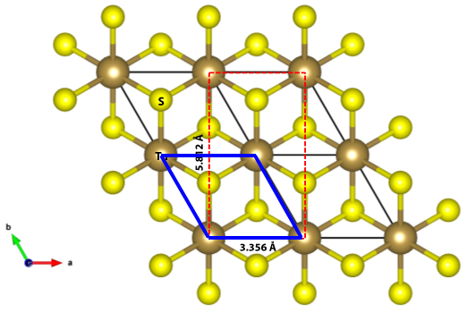
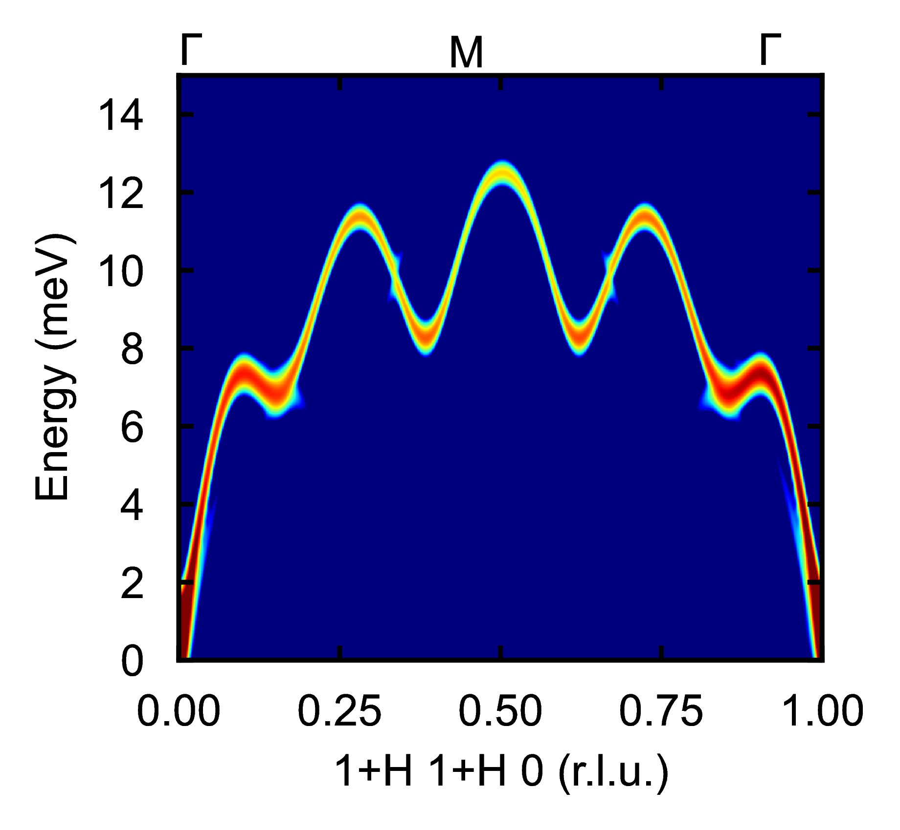
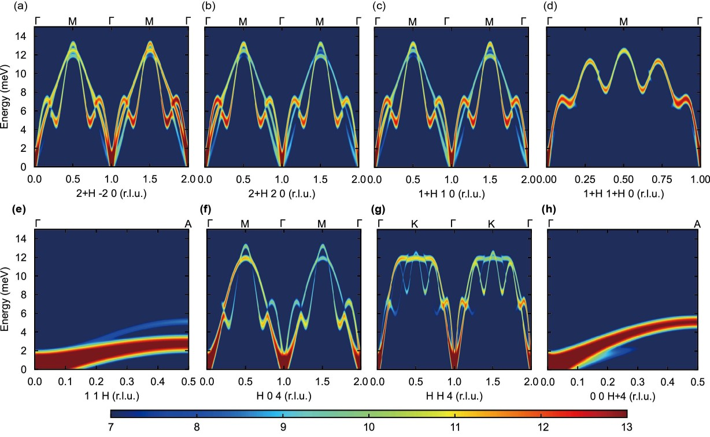

# Tutorial: SQE Calculation for TaS2 in Multiple Brillouin Zones

This tutorial outlines the setup for calculating the dynamical structure factor (SQE) for TaS2, a charge density wave material with multiple phase transitions. 

Due to instrumental geometry constraints in triple-axis spectrometers and inelastic X-ray scattering (IXS) experiments, measurements in high-Q regions or certain positive-index zones are often limited. For phase-transition materials like TaS2, studying phonon evolution under external fields (e.g., temperature, pressure) is critical, but limited beam time makes it challenging to capture all phonon information in a single experiment. Thus, efficient measurement strategies are essential, often requiring multiple calculations to compare and select optimal scattering regions.

In our recent study of TaS2, we measured phonon evolution near phase transition points at four temperature points. Based on SQE simulations, we selected three scattering regions—(2,-2,0), (1,1,0), and (0,0,4)—and measured along high-symmetry directions (Γ–M, Γ–K, Γ–A). This tutorial details the parameter settings for the (1+H, 1+H, 0) region and explains the strategy for selecting scattering regions and paths.

## Parameter Settings for (1+H, 1+H, 0)

### 1. Basic Section

The `&basic` section defines the system's fundamental properties based on the POSCAR file:

- **ntypes = 2**: Specifies two atom types, Ta (Tantalum) and S (Sulfur).
- **natoms = 3**: Indicates three atoms in the unit cell, consistent with TaS2's layered structure.
- **nsize = 8 8 4**: Defines an 8x8x4 supercell for the FORCE_CONSTANTS calculation to ensure accurate phonon sampling in this complex material.

### 2. Input SQE Section

The `&inputsqe` section configures the SQE calculation parameters:

- **elements = "Ta" "S"**: Specifies the elements in the unit cell.
- **nat = 1 2**: Indicates one Ta atom and two S atoms in the unit cell.

The conventional lattice vectors (`clatvec`) are defined to perform the calculation in an orthogonal lattice:

```
clatvec(:,1) = 3.355507468   0.000000000  -0.000000000
clatvec(:,2) = 0.000000000   5.811909420   0.000000000
clatvec(:,3) = 0.000000000   0.000000000   6.000644917
```

These are derived from the primitive cell lattice vectors in the POSCAR:

```
3.355507468   0.000000000  -0.000000000
-1.677753733   2.905954710   0.000000000
0.000000000   0.000000000   6.000644917
```
This transformation is based on below picture, where red lattice vectors are 'clatvec' while blue lattice vectors are 'primitive cell lattice vectors in the POSCAR'.



- **temp = 300.d0**: Sets the temperature to 300 K, relevant for studying phonon behavior near phase transitions.
- **lneutron = .FALSE.**: Disables neutron scattering.
- **lxray = .TRUE.**: Enables X-ray scattering, suitable for probing electron density in TaS2.
- **qmesh = 20 20 20**: Specifies a 20x20x20 Q-point mesh for integration to achieve converged root-mean-square displacement (RMSD).
- **write_rmsd = .TRUE.**: Writes RMSD data in the first calculation. For subsequent runs, comment this out and use `read_rmsd = .TRUE.`.
- **espresso = .TRUE.**: Enables integration with Quantum ESPRESSO for force constant calculations.

The high-symmetry path is defined as:

- **path(:,1) = 1 3 0**: Specifies the direction in the conventional cell, suitable for capturing longitudinal acoustic (LA) modes. Note the convertion of path between "conventional cell/ or called LATTICE_PARAMETERS" and "clatvec" part can refer to the example at "../GaN/3D_SQE/GaN_3D_SQE_Calculation.markdown"

Energy settings:

- **ne = 300**: Sets 300 energy points.
- **deltaE = 0.05**: Specifies an energy step size of 0.05 meV, covering a 15 meV range (300 * 0.05).

Q-point sampling along the H direction:

- **nqh = 200**: Number of Q-points along H.
- **deltaH = 0.005**: Step size along H, resulting in a total propagation distance of `nqh * deltaH = 200 * 0.005 = 1.0`.

Integration in the K and L directions:

- **nqk = 5**, **nql = 5**: Number of Q-points in K and L for integration.
- **deltaK = 0.005**, **deltaL = 0.005**: Step sizes in K and L, yielding integration thicknesses of `nqk * deltaK = 5 * 0.005 = 0.025` and `nql * deltaL = 5 * 0.005 = 0.025`.

Starting point for the Q-vector:

- **q0 = 1.d0 3.d0 0.d0**: Sets the origin at (1, 1, 0) in reciprocal space of conventional , targeting the (1+H, 1+H, 0) region for measurements. Note the convertion of q0 between "conventional cell/ or called LATTICE_PARAMETERS" and "clatvec" part can refer to the example at "../GaN/3D_SQE/GaN_3D_SQE_Calculation.markdown"


No LO-TO splitting is considered:

- **nonanalytic = .FALSE.**

Instrument resolution settings:

- **lresfunc = .TRUE.**: Enables the resolution function.
- **functype = "CNCS12"**: Specifies the CNCS12 instrument model (used as a proxy for X-ray scattering).
- **xm = 2**: Sets the instrument parameter.

### 3. Lattice Parameters

The lattice parameters define the primitive cell:

```
LATTICE_PARAMETERS
1.d0
3.355507468   0.000000000  -0.000000000
-1.677753733   2.905954710   0.000000000
0.000000000   0.000000000   6.000644917
```

### 4. Atomic Positions

The atomic positions in direct coordinates are:

```
ATOMIC_POSITIONS
Direct
0.000000000   0.000000000  -0.000000000
0.333333333   0.666666667   0.255327342
0.666666667   0.333333333   0.744672658
```

### Complete Input File for (1+H, 1+H, 0)

Below is the complete input file for the SQE calculation:

```
! Example of SQE input file for TaS2

&basic
ntypes = 2 
natoms = 3
nsize = 8 8 4
/

&inputsqe
elements = "Ta"  "S"
nat = 1 2
clatvec(:,1) = 3.355507468   0.000000000  -0.000000000
clatvec(:,2) = 0.000000000   5.811909420   0.000000000
clatvec(:,3) = 0.000000000   0.000000000   6.000644917 
temp = 300.d0
lneutron = .FALSE.
lxray = .TRUE.
qmesh = 20 20 20
write_rmsd = .TRUE.
! read_rmsd = .TRUE.
espresso= .TRUE.
path(:,1) = 1 3 0
ne = 300
deltaE = 0.05
nqh = 200
nqk = 5
nql  = 5
deltaH = 0.005
deltaK =  0.005
deltaL =   0.005
q0 = 1.d0   3.d0   0.d0
nonanalytic = .FALSE.
lresfunc = .TRUE.
functype = "CNCS12"
xm = 2
/

LATTICE_PARAMETERS
1.d0
3.355507468   0.000000000  -0.000000000
-1.677753733   2.905954710   0.000000000
0.000000000   0.000000000   6.000644917

ATOMIC_POSITIONS
Direct
0.000000000   0.000000000  -0.000000000
0.333333333   0.666666667   0.255327342
0.666666667   0.333333333   0.744672658
```

## Execution

1. Place the input file (e.g., `TaS2.txt`) in the working directory.
2. Run the command:
   ```bash
   /your_path_to_dysurf/dysurf TaS2.txt
   ```
   This generates the SQE data for the (1+H, 1+H, 0) region.
3. Run the Python script(eg. `./1+H1+H0/1+h1+h0plot.py`) for visulization as shown below:



## Scattering Region Selection and Results
After change other q0 and paths, we can get results at different Briilion zones. And then, we can compare these results to choose suitable case for measurement.

To comprehensively study phonon evolution, we performed SQE calculations for three scattering regions—(2,-2,0), (1,1,0), and (0,0,4)—along high-symmetry directions (Γ–M, Γ–K, Γ–A). By varying `q0` and `path(:,1)`, we obtained the following results:


## Measurement Strategy

### Region (2,-2,0)

Measured along (2+ξ,-2,0) to capture the longitudinal acoustic (LA) branch in the Γ–M direction (panels a-b).

Chosen because the instrument cannot cover higher-order or positive-index zones like (2,2,0), and the transverse acoustic (TA) branch intensity is higher here than in (1,1,0) (compare panels a and c).

### Region (1,1,0):

Measured along (1+ξ,1+ξ,0) for the LA branch in the Γ–M direction and along (1,1,ξ) for the TA branch in the Γ–A direction (panels c-e).

Complements (2,-2,0) by capturing the LA branch in the Γ–K direction and the TA branch in the Γ–A direction, with clear phonon signals (panel d).

### Region (0,0,4):
 
Measured along (ξ,0,4) and (ξ,ξ,4) for the TA branches in the Γ–M and Γ–K directions, respectively, and along (0,0,4+ξ) for the LA branch in the Γ–A direction (panels f-h).

Selected due to high phonon intensity in this region (panels f-h).

### Rationale for Region Selection

**(2,-2,0)**: Preferred over (2,2,0) due to instrumental limitations and higher TA branch intensity compared to (1,1,0).

**(1,1,0)**: Provides access to Γ–K LA and Γ–A TA branches, which are not measurable in (2,-2,0), ensuring comprehensive phonon coverage.

**(0,0,4)**: Chosen for its high phonon intensity, making it ideal for capturing clear TA and LA signals.

## Notes

**Instrumental Constraints**: High-Q or positive-index zones are often inaccessible, necessitating careful selection of low-Q or equivalent zones like (2,-2,0).

**Multiple Calculations**: Performing batch calculations for different q0 and path(:,1) values (e.g., for (2,-2,0), (1,1,0), (0,0,4)) allows optimization of measurement strategies within limited beam time.

**Phase Transition Studies**: The choice of four temperature points and multiple scattering regions ensures robust tracking of phonon evolution near phase transitions in TaS2.

**X-ray Scattering**: Enabling lxray = .TRUE. is suitable for TaS2 due to the strong electron density contrast of Ta atoms, enhancing SQE signals.

This setup provides an efficient framework for studying phonon dynamics in TaS2, balancing instrumental constraints with comprehensive phonon characterization.