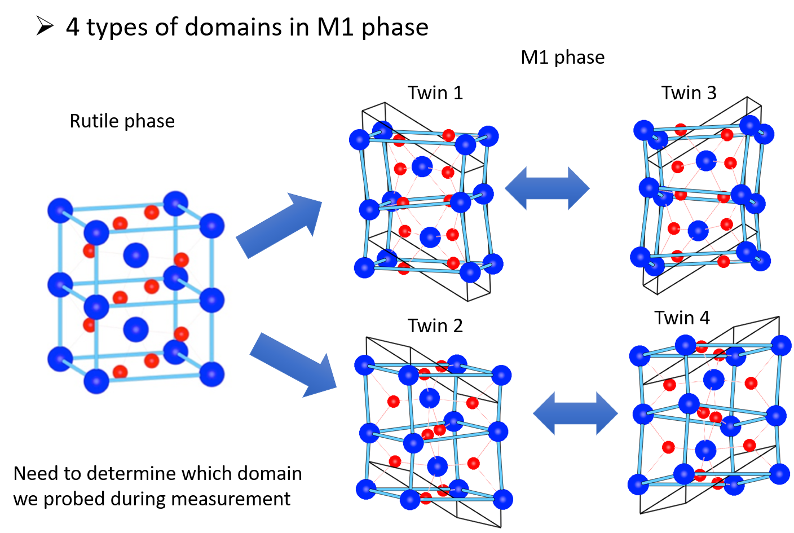
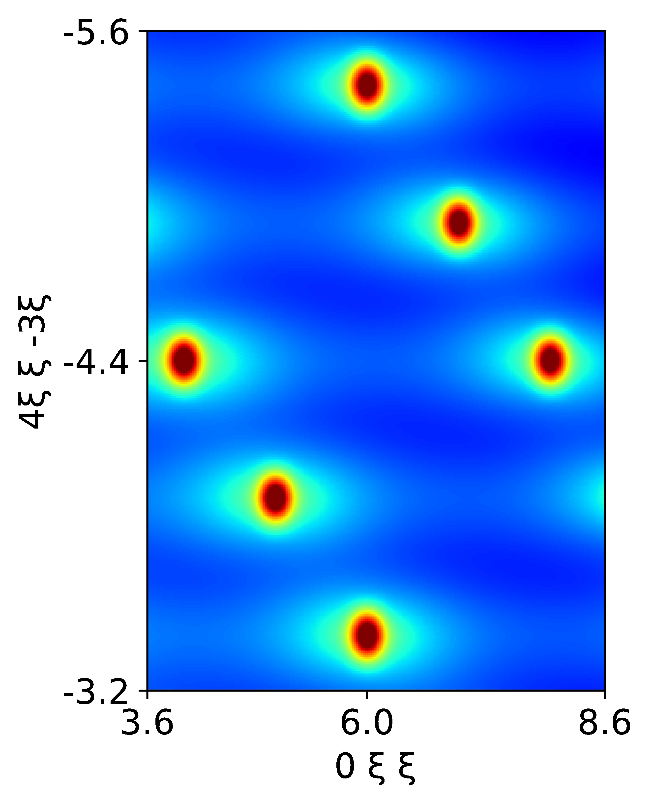
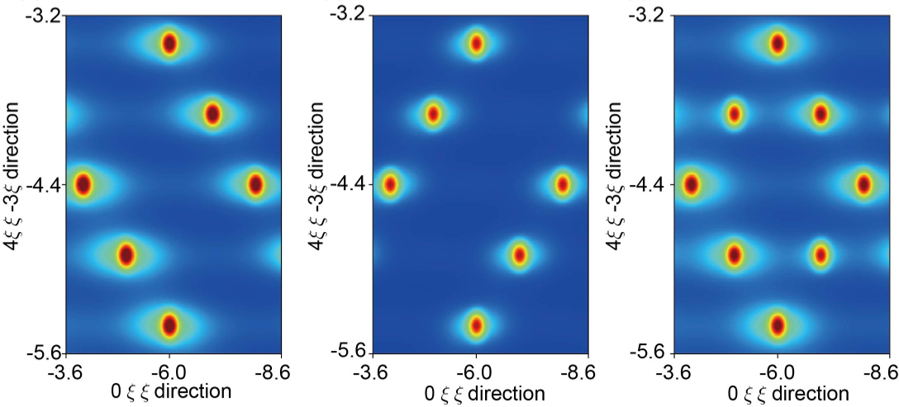

# Tutorial: TDS Calculation for VO2 Using SQE Simulation

This tutorial introduces the use of Thermal Diffuse Scattering (TDS) as a powerful method for investigating structural information in materials by analyzing the evolution of Bragg peak intensities and redistributed scattering intensities along Q-point paths. We present a previous study on VO<sub>2</sub> to demonstrate TDS utilization. VO<sub>2</sub> exhibits an insulating monoclinic (M1) phase below Tc = 340 K and transitions to a metallic tetragonal (R) phase above Tc = 340 K.

During the metal-insulator transition (MIT) near room temperature from the R phase to the M1 phase, four possible twinned domains can form, as shown below:



The key issue is that VO<sub>2</sub> undergoes a phase transition at low temperatures from the tetragonal rutile phase to the monoclinic phase, resulting in four possible domains. Due to structural changes, the reciprocal space differs for each domain, leading to distinct TDS patterns during scattering. Domains 1 and 3 are equivalent, as are domains 2 and 4. However, experimentally distinguishing these domains is nearly impossible, as the scattering from the sample yields a random or statistical result, representing a combined effect. Therefore, computational simulations are essential to differentiate these domains.

To determine which domains in the monoclinic phase were probed during Inelastic X-ray Scattering (IXS) measurements, predictive and accurate simulations of IXS spectroscopies are crucial for analyzing experimental results. This example demonstrates simulated X-ray TDS profiles of {1$\bar{1}$1} slices.

Here, we identify three vectors perpendicular to {1<span style="text-decoration: overline">1</span>1} for twin 1 or twin 3: (0 1 1), (4 1 -3) and (0 -1 1). q0 is set as (3.2 -5.9 2.9).

For twin 2 or twin 4, we identify three vectors according to  twin 2 or twin 4: (0 1 -1), (4 -1 -3) and (0 1 1). q0 is set as (3.2 4.5 4.3).

The input file is configured for SQE simulation in an orthogonal coordinate system for VO<sub>2</sub>, focusing on TDS calculations.

## Parameter Settings

### 1. Basic Section

The `&basic` section defines the system's fundamental properties:

- **ntypes = 2**: Specifies two atom types, V (Vanadium) and O (Oxygen).
- **natoms = 12**: Indicates 12 atoms in the unit cell, reflecting VO2's monoclinic structure in the M1 phase.
- **nsize = 2 2 2**: Defines a 2x2x2 supercell for the FORCE_CONSTANTS calculation.

### 2. Input SQE Section

The `&inputsqe` section configures the SQE and TDS calculation parameters:

- **elements = "V" "O"**: Specifies the elements in the unit cell.
- **nat = 4 8**: Indicates four V atoms and eight O atoms in the unit cell.

The conventional lattice vectors (`clatvec`) are defined for an orthogonal system:

```
clatvec(:,1) = 5.758484905532  0.0000000000000000    0.0000000000000000
clatvec(:,2) = 0.0000000000000000   4.588510384900  0.0000000000000000
clatvec(:,3) = 0.0000000000000000    0.0000000000000000   9.173
```

- **temp = 320.d0**: Sets the temperature to 320 K, close to the MIT temperature for studying transition-related phonons.
- **lneutron = .FALSE.**: Disables neutron scattering.
- **lxray = .TRUE.**: Enables X-ray scattering, suitable for TDS simulations in IXS.
- **qmesh = 20 20 20**: Specifies a 20x20x20 Q-point mesh for RMSD convergence.
- **read_rmsd = .TRUE.**: Reads previously computed RMSD (assuming a prior run with `write_rmsd = .TRUE.`).
- **path(:,1) = 6.81671939e-04 1.00000000e+00 2.00001242e+00**: Approximates (0, 1, 2), derived from (0, 1, 1) scaled or adjusted for the reciprocal space.
- **path(:,2) = 3.99933323  1.         -1.95802943**: Approximates (4, 1, -2), derived from (4, 1, -3) adjusted.
- **path(:,3) = 6.81671939e-04 -1.00000000e+00  2.00001242e+00**: Approximates (0, -1, 2), derived from (0, -1, 1) adjusted.

Starting point for the Q-vector:

- **q0 = 3.20307944 -5.9 9.03364227**: Chosen to center the grid in a specific Brillouin zone corresponding to the {1\bar{1}1} slice, ensuring the simulation captures the relevant reciprocal space region for TDS profiles.

**Here, the path can be converted by `uc_vector_twin1.in`**,which is:
```
con
 5.758484905532  0.0000000000000000    0.0000000000000000
 0.0000000000000000   4.588510384900  0.0000000000000000
 0.0000000000000000    0.0000000000000000    9.173
pri
   5.7584840568014242    0.0000000000000000   -0.0031264684770812
   0.0000000000000000    4.5885103849004407    0.0000000000000000
  -2.9094616381615008    0.0000000000000000    4.5880511677025799
p2c
4
0 1 1
4 1 -3
0 -1 1
3.2 -5.9 2.9
```
and then execute "python pri2con.py".

Energy settings:

- **ne = 400**: Sets 400 energy points.
- **deltaE = 0.25**: Specifies an energy step size of 0.25 meV, covering a 100 meV range.

Q-point sampling for a 3D grid (suitable for TDS slices):

- **nqh = 70**, **nqk = 70**, **nql = 6**: Number of Q-points along H, K, and L directions, creating a 70x70x6 grid for the {1\bar{1}1} slice (thin in L for 2D-like slice).
- **deltaH = 0.05**, **deltaK = 0.05**, **deltaL = 0.005**: Step sizes, resulting in ranges of 3.5 in H and K, and 0.03 in L.

No LO-TO splitting:

- **nonanalytic = .FALSE.**

Instrument resolution:

- **lresfunc = .TRUE.**: Enables resolution function.
- **functype = "CNCS20"**: Specifies CNCS20 instrument (proxy for IXS).
- **xm = 1**: Instrument parameter.

TDS and phase settings:

- **ltds = .TRUE.**: Enables TDS calculation, essential for simulating diffuse scattering.
- **lphase = .TRUE.**: Includes phase factors for accurate interference in scattering.

### 3. Lattice Parameters

The lattice parameters define the unit cell:

```
LATTICE_PARAMETERS
1.d0
5.7584840568014242    0.0000000000000000   -0.0031264684770812
0.0000000000000000    4.5885103849004407    0.0000000000000000
-2.9094616381615008    0.0000000000000000    4.5880511677025799
```

### 4. Atomic Positions

The atomic positions in direct coordinates are:

```
ATOMIC_POSITIONS
Direct
0.2337797960912273  0.5213528868487105  0.5266885372058515
0.2337797960912273  0.9786471131512895  0.0266885372058512
0.7662202039087728  0.0213528868487106  0.9733114627941485
0.7662202039087728  0.4786471131512893  0.4733114627941489
0.1088719567570400  0.2824124171822511  0.7156096403111575
0.1088719567570400  0.2175875828177490  0.2156096403111575
0.8911280432429601  0.7824124171822511  0.7843903596888425
0.8911280432429601  0.7175875828177489  0.2843903596888426
0.3997944482645969  0.7998515047834769  0.8017509636404480
0.3997944482645969  0.7001484952165231  0.3017509636404478
0.6002055517354032  0.2998515047834769  0.6982490363595520
0.6002055517354032  0.2001484952165231  0.1982490363595522
```

### Complete Input File

Below is the complete input file for the SQE/TDS calculation:

```
! SQE input file for VO2 orthogonal

&basic
ntypes = 2 
natoms = 12
nsize = 2 2 2
/

&inputsqe
elements = "V" "O"
nat = 4 8
clatvec(:,1) =  5.758484905532  0.0000000000000000    0.0000000000000000
clatvec(:,2) =  0.0000000000000000   4.588510384900  0.0000000000000000
clatvec(:,3) =  0.0000000000000000    0.0000000000000000   9.173
temp = 320.d0
lneutron = .FALSE.
lxray = .TRUE.
qmesh = 20 20 20
!write_rmsd = .TRUE.
read_rmsd = .TRUE.
!espresso = .TRUE.
path(:,1) = 6.81671939e-04 1.00000000e+00 2.00001242e+00
path(:,2) =  3.99933323  1.         -1.95802943
path(:,3) =  6.81671939e-04 -1.00000000e+00  2.00001242e+00
ne = 400
deltaE = 0.25
nqh = 70
nqk = 70
nql = 6
deltaH = 0.05
deltaK = 0.05
deltaL = 0.005
q0 =  3.20307944 -5.9         9.03364227
nonanalytic = .FALSE.
lresfunc = .TRUE.
functype = "CNCS20"
xm = 1
ltds=.TRUE.
lphase=.TRUE.
/

LATTICE_PARAMETERS
1.d0
5.7584840568014242    0.0000000000000000   -0.0031264684770812
0.0000000000000000    4.5885103849004407    0.0000000000000000
-2.9094616381615008    0.0000000000000000    4.5880511677025799

ATOMIC_POSITIONS
Direct
0.2337797960912273  0.5213528868487105  0.5266885372058515
0.2337797960912273  0.9786471131512895  0.0266885372058512
0.7662202039087728  0.0213528868487106  0.9733114627941485
0.7662202039087728  0.4786471131512893  0.4733114627941489
0.1088719567570400  0.2824124171822511  0.7156096403111575
0.1088719567570400  0.2175875828177490  0.2156096403111575
0.8911280432429601  0.7824124171822511  0.7843903596888425
0.8911280432429601  0.7175875828177489  0.2843903596888426
0.3997944482645969  0.7998515047834769  0.8017509636404480
0.3997944482645969  0.7001484952165231  0.3017509636404478
0.6002055517354032  0.2998515047834769  0.6982490363595520
0.6002055517354032  0.2001484952165231  0.1982490363595522
```

## Execution

1. Ensure RMSD is computed beforehand if using `read_rmsd = .TRUE.`.
2. Place the input file (e.g., `VO2.txt`) in the working directory.
3. Run the command:
   ```bash
   /your_path_to_dysurf/dysurf VO2.txt
   ```
   This generates the TDS data for the {1\bar{1}1} slice.
4. run python script for visulization `./tds/TDStwin1plot.py` and the result is shown as below:


After we change to path and q0 selection with twin2 or twin4, and combine them together, we will get result as below:



The simulated X-ray TDS profiles of {1\bar{1}1} slices in reciprocal space for the combined structures, twin 1/twin3, twin2/twin4, respectively. 

## Explanation of Path and q0 Selection

These vectors are chosen because:
- They are mutually orthogonal, facilitating a rectangular grid in the simulation (70x70 in H-K, thin 6 points in L for slice approximation).
- They lie in (or define) the plane perpendicular to {1\bar{1}1}, allowing efficient mapping of TDS intensities across the slice without unnecessary computation outside the plane.
- The slight deviations (e.g., small components like 6.81671939e-04) account for structural specifics in VO2's reciprocal space, ensuring alignment with the monoclinic lattice.

The `q0 ≈ (3.2, -5.9, 9.0)` is selected as the starting point to center the grid in a relevant Brillouin zone, capturing domain-specific TDS patterns for comparison with IXS data. This choice enables differentiation of twinned domains by simulating distinct reciprocal space features.

If you are interested in phase transition of VO<sub>2</sub> in more detail, you can refer to our previous work: **Nature 515, 535–539 (2014)**.

## Notes

- **TDS for Domain Differentiation**: Enabling `ltds = .TRUE.` computes diffuse scattering, crucial for distinguishing equivalent domains (1/3 vs. 2/4) where experimental IXS cannot.

- **Note which direction is to be integrated**: in this example, path(:,3)
are used for the integrated. When you calculated TDS, you should understand which direction you will integrate.

This setup provides a framework for TDS simulations in VO2, aiding in domain identification during phase transitions.
